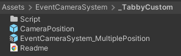
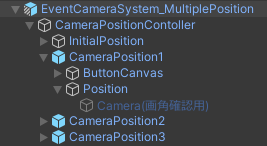

# はじめに<!-- omit in toc -->
本UnityPackageは黒鳥ケモノ工房さんのEventCameraSystem(https://booth.pm/ja/items/4848817)をMITライセンスに基づき改変再配布しているものになります

本アセットのサンプルワールドは以下で公開しています 
https://vrchat.com/home/world/wrld_56dd50ea-9c0c-4d4b-a4a0-1cfba83fd6e2/info

目次
- [セットアップ方法](#セットアップ方法)
- [改変方法](#改変方法)
  - [プレハブ説明](#プレハブ説明)
  - [カメラ位置](#カメラ位置)
  - [ボタン表記](#ボタン表記)
  - [カメラポジション追加](#カメラポジション追加)

## セットアップ方法
本UnityPackageのインポート前に改変元のUnityPackageをインポートしてください 
追加されるファイルは以下の通りです

 

|||
|-|-|
|_TabbyCustomフォルダ|本パッケージで追加されるフォルダです この中のアセットを使用していきます|
|それ以外|改変元のままです|

 

|||
|-|-|
|Scriptフォルダ|ギミック動作用のUdonです 触らんで大丈夫です|
|CameraPositionプレハブ |カメラ位置を増やしたい場合に追加するプレハブです 設定手順は後述します|
|EventCameraSystem_MultiplePositionプレハブ|メインのギミックです Sceneポン置きで使用できます 細かい設定手順は後述します|
|||

## 改変方法
### プレハブ説明

|||
|-|-|
|CameraPositionContoller|カメラ位置調整用のオブジェクトです 子階層の細かい使い方は後述します|
|OwnerDisplay|カメラ位置の調整が可能なオーナーを表示変更できるオブジェクトです 好きな位置に配置してください|
|Camerabase|改変元とほぼ変わりありませんがここの位置はCameraPositionContollerで初期位置として記憶され移動対象となります 好きな位置に配置してください|
|それ以外|改変元のままです|

### カメラ位置
「CameraPositionController」内にあるオブジェクトで調整します

 

|||
|-|-|
|ButtonCanvas|該当のポジションへ移動するためのボタンオブジェクトです 好きな位置に配置してください ボタン表記の改変は[\[ボタン表記\]](#ボタン表記)の章で解説します|
|Position|カメラの移動先です 移動先の確認用で子オブジェクトにカメラが入っています 子のカメラはアップロードされず移動先はあくまでPositionオブジェクトの座標である点に注意ください|

   
**以下執筆中...**

### ボタン表記
### カメラポジション追加
